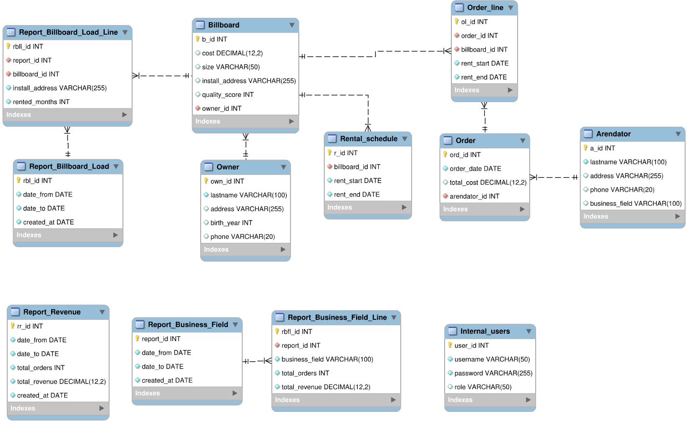
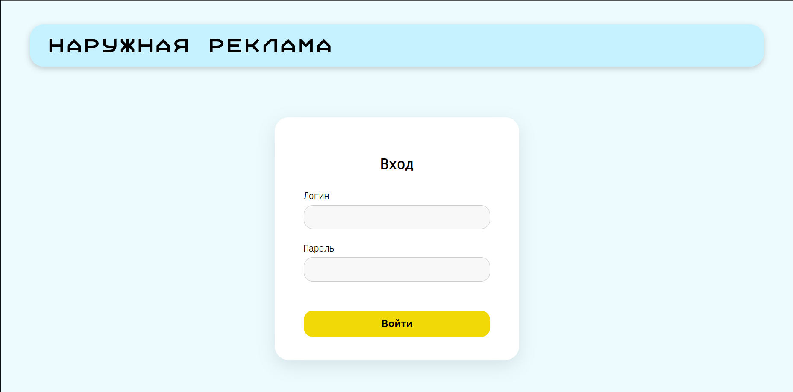
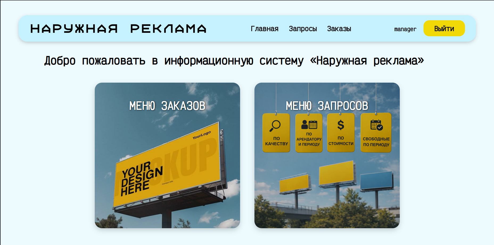
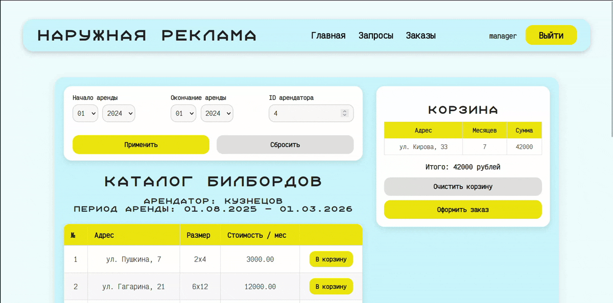

# Billboard Rental System

Информационная система для управления арендой рекламных билбордов.

Проект разработан на Flask и предназначен для внутренних пользователей компании, занимающейся размещением наружной рекламы. Система позволяет выполнять поиск и подбор рекламных площадок, оформлять заказы, работать с аналитическими запросами и формировать отчёты.

## Возможности

### Авторизация и контроль доступа

* Аутентификация пользователей по логину и паролю
* Разграничение доступа на основе ролей
* Ограничение доступа к функционалу системы

### Работа с каталогом билбордов

* Просмотр доступных рекламных конструкций
* Фильтрация по периоду аренды
* Проверка занятости билбордов
* Постраничный вывод результатов

### Оформление заказов

* Добавление билбордов в корзину
* Расчёт стоимости аренды
* Формирование заказа
* Сохранение заказа в базе данных
* Использование транзакций при оформлении заказа

### Аналитические запросы

* Выполнение параметризованных SQL-запросов
* Поиск данных по арендаторам и рекламным конструкциям
* Получение информации по заданным критериям

### Отчёты

* Формирование отчётов по выручке
* Формирование отчётов по активности арендаторов
* Сохранение сформированных отчётов в базе данных

## Технологии

* Python
* Flask
* MySQL
* Jinja2
* HTML/CSS

## Архитектура проекта

Проект построен с использованием Flask Blueprints.

```text
auth/       - аутентификация и контроль доступа
orders/     - каталог билбордов и оформление заказов
query/      - аналитические запросы
reports/    - формирование отчётов
database/   - слой работы с базой данных
sql/        - SQL-запросы
```

## Структура базы данных

База данных включает сущности:

* Владельцы рекламных конструкций
* Арендаторы
* Билборды
* Заказы
* Позиции заказов
* График аренды
* Пользователи системы
* Отчёты

SQL-дамп базы данных находится в файле:

```text
dump.sql
```

## Установка

Установить зависимости:

```bash
pip install -r req.txt
```

Создать файл конфигурации базы данных:

```json
{
    "host": "localhost",
    "user": "username",
    "password": "password",
    "database": "advertising_db"
}
```

и сохранить его как:

```text
data/db_config.json
```

## Запуск

```bash
python app.py
```

После запуска приложение будет доступно по адресу:

```text
http://127.0.0.1:5000
```

## Документация

В рамках проектирования были подготовлены:

* Диаграмма вариантов использования


* Диаграммы последовательностей для основных бизнес-процессов
* Логическая модель базы данных



## Назначение проекта

Проект разработан в учебных целях для изучения веб-разработки на Flask, проектирования реляционных баз данных и реализации информационных систем с разграничением прав доступа.

## Screenshots

### Login Page


### Main Menu


### Billboard Catalog

